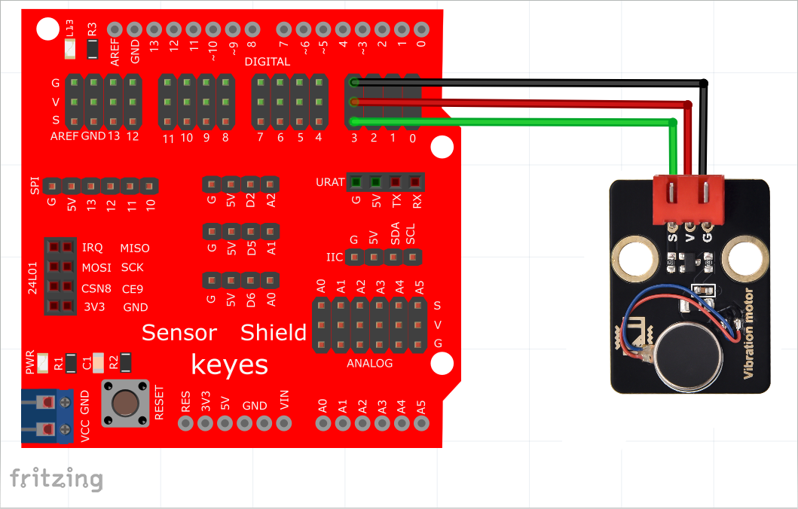
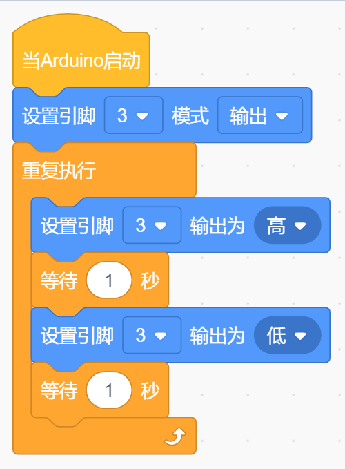

# KidsBlock

## 1. KidsBlock简介  

KidsBlock是一款基于图形化编程的学习工具，旨在让孩子们通过使用模块化的可视化编程环境，轻松了解编程和电子学的基本概念。这种工具通过简单的拖放操作使编程变得生动有趣，由此鼓励孩子们在学习中创造和探索。KidsBlock支持多种硬件平台，尤其适合与Arduino结合使用，为初学者提供了丰富的教程和项目示例。该平台不仅能够帮助孩子们学习编程，还能培养他们的逻辑思维和解决问题的能力，为他们今后的学习打下坚实的基础。  

## 2. 接线图  

  

## 3. 测试代码  

  

## 4. 代码说明  

1. 我们找到并设置了控制模块和数值模块，以将引脚3设置为输出模式，并连接到模块的信号端D3。  

2. 从“控制”模块拖出一个延时模块，设定延迟时间为1秒（默认为1秒，如果填0.1则代表0.1秒）。  

3. 通过整合前面知识，代码中设置引脚3为高电平，使模块上的马达震动1秒；之后的延迟设置让模块停止震动1秒。这些代码块用于实现循环震动和停止功能，用户也可以根据需要更改马达震动和停顿的时间。  

## 5. 测试结果  

烧录好测试代码后，按照接线图连接好线，通电后，模块上的元件将震动1秒，停止震动1秒，并循环交替进行。

