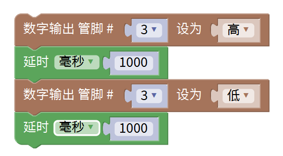

# Mixly

## 1. Mixly简介  

Mixly是一款基于图形化编程的学习环境，特别设计用于帮助初学者和儿童理解编程的基本概念。通过简单的拖放式界面，用户可以直观地创建Arduino项目，体验编程带来的乐趣。Mixly支持多种编程语言，包括Scratch和Arduino C，用户可以通过使用丰富的模块和组件实现各种功能。该平台适合用于教育、创意项目和个人开发，不仅可以帮助学习编程基础，还能激发用户的创造力和动手能力，是学习物联网与电子工程的理想工具。  

## 2. 接线图  

  

## 3. 测试代码（测试软件：Mixly 1.2.0）  

  

## 4. 代码说明  

1. 我们从Mixly软件的输入/输出模块中找到并设置了相关组件。   
   
2. 从“控制”模块中找到并拖出延时模块，设置1000为延时的毫秒数，默认1000毫秒，代表延迟1000毫秒（即1秒）。  

3. 从整体代码来看，第一条指令是将模块信号端接到D3，设置为高电平以让马达震动；第二条指令延迟1000毫秒，使马达震动1秒。接下来的指令则控制马达停止1秒。该代码默认循环执行。  

## 5. 测试结果  

烧录好测试代码后，按照接线图连接好线，上电后，模块上的元件将震动1秒，停止震动1秒，并循环交替进行。

