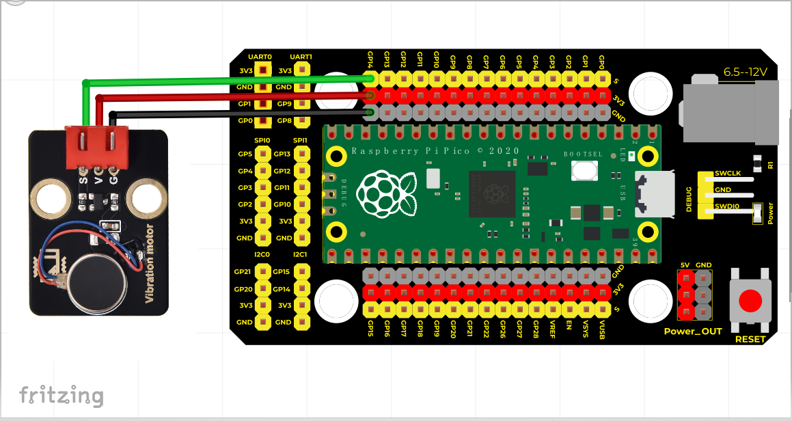

# Python


## 1. Python简介  

Python是一种高级编程语言，因其简洁易懂的语法、强大的库支持以及广泛的应用领域而受到广大开发者的喜爱。Python起源于20世纪90年代，至今已成为数据科学、人工智能、网络开发、自动化和教育等各个领域的重要工具。其动态类型系统和自动内存管理特性使得程序员能够更快地开发和测试代码。此外，Python支持多种编程范式，包括面向对象、命令式和函数式编程，且拥有丰富的第三方库，如NumPy、Pandas、TensorFlow等，使其极其适合进行科学计算和数据处理。  

## 2. 接线图  

  

## 3. 测试代码（测试软件：Thonny）  

```python  
import machine  
import utime  

external = machine.Pin(14, machine.Pin.OUT) # 设置GPIO14为输出  

while True:  
    external.value(1) # 马达震动  
    utime.sleep(1) # 延时1秒  
    external.value(0) # 马达停止震动  
    utime.sleep(1) # 延时1秒  
```  

## 4. 代码说明  

1. 在这段代码中，我们首先导入了`machine`和`utime`模块，前者用于与硬件进行交互，后者用于控制程序的延时。  

2. `external = machine.Pin(14, machine.Pin.OUT)`：这行代码将GPIO14配置为输出模式，允许我们控制该引脚以驱动连接的外部设备（如电机）。  

3. 进入`while True`循环，代码将持续执行以下操作：  
   - `external.value(1)`：将引脚状态设为高电平，驱动连接的马达振动。  
   - `utime.sleep(1)`：暂停程序1秒，使马达震动保持1秒。  
   - `external.value(0)`：将引脚状态设为低电平，使马达停止振动。  
   - `utime.sleep(1)`：再次暂停程序1秒，让马达保持停止状态。  

## 5. 测试结果  

烧录好测试代码后，按照接线图连接好设备并上电，模块上的元件将每隔1秒振动一次，然后停止1秒，循环交替进行。


